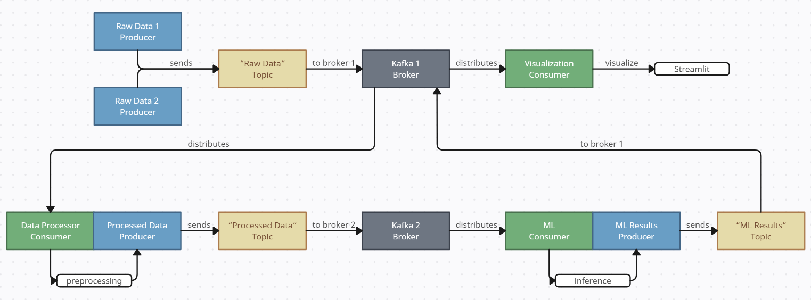

# Лабораторная работа #1
## Task:

Познакомиться с принципом работы Kafka и применить его на практике, выполнив следующие пункты:
* Имитировать сбор данных.
* Обработка данных, препроцессинг.
* Анализ данных с помощью ML/DL.
* Визуализация — создать Dashboard с использованием Streamlit.

**P.S.**:
* Настроить окружение (Docker).
* Найти или сгенерировать датасет, что будет использоваться на шаге имитации сбора данных.

## Project structure:
    .
    ├── data                        # папка под данные, необходимые для/полученные при работе
    │   ├── fraud test.csv          # изначально рассматриваемый датасет, на нём обучалась модель
    │   └── data_simple.csv         # облегчённая версия датасета для Kafka
    ├── models                      # общая папка под модели
    │   ├── KNN.pkl                 # обученная KNN модель для инференса
    │   └── LabelEncoders.pkl       # encoder-ы для некоторых данных в датасете (нужен, чтобы в инференсе было соответствие с тем, на чём обучалась модель)
    ├── scripts                     # папка под скрипты
    │   ├── generation.py           # скрипт, имитирующий генерацию данных
    │   ├── processing.py           # скрипт, обрабатывающий входящие данные
    │   ├── ML_inference.py         # скрипт для инференса предобученной (в preparation.ipynb) модели
    │   ├── visualization.py        # скрипт для визуализации
    │   └── settings.py             # файл для различных настроек других скриптов
    ├── images                      # папка под картинки
    │   └── ... 
    ├── info                        # папка под полезную информацию
    │   └── ... 
    ├── run.py                      # файл для быстрого запуска проекта
    ├── preparation.ipynb           # файл с анализом датасета и обучением модели
    ├── docker-compose.yml          # описание Docker контейнеров для Kafka брокеров
    ├── README.md                   # файл, содержащий основную информацию о проекте
    └── requirements.txt            # файл со списком необходимых библиотек для работы проекта


## Setup:
1) Установить образ Kafka командой (должен быть запущен Docker Desktop и выполнен вход в систему):
```
docker pull bitnami/kafka
```
2) В файле `./scripts/settings.py` настроить значения под свою систему, например:
```
PYTHON_PATH = "/bin/python"
DOWNLOAD_REQUIREMENTS = True
```
3) Запустить из корневой папки (`./1) Kafka/`) следующую команду:
```
python ./run.py
```
* Может пройти некоторое время (несколько минут) до начала отображения, пока запускается Kafka.
* Для прерывания выполнения нужно воспользоваться комбинацией клавиш **Ctrl + C**.

## Results:
*Kafka структура:*




*Пример отображения Streamlit:*


## Links:
* [Датасет](https://www.kaggle.com/datasets/kelvinkelue/credit-card-fraud-prediction/), используемый в работе
* [Сервис](https://creately.com/ru/lp/%D0%9F%D1%80%D0%BE%D0%B3%D1%80%D0%B0%D0%BC%D0%BC%D0%B0-%D0%B1%D0%BB%D0%BE%D0%BA-%D1%81%D1%85%D0%B5%D0%BC-%D0%BE%D0%BD%D0%BB%D0%B0%D0%B9%D0%BD/) для рисования графиков