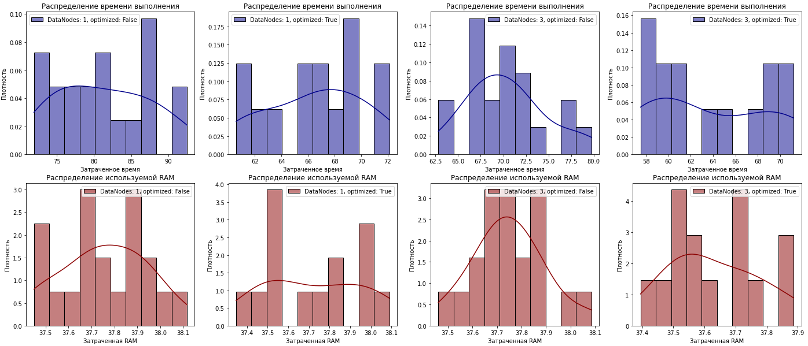

# Лабораторная работа #2

## Task:
Отслеживание вычислительных затрат Spark приложения при запуске на Hadoop с разными настройками. Работа состоит из следующих шагов:
* Подготовить датасет, в котором будет 100 000+ записей, каждая из которых будет иметь 6+ признаков (минимум 3 разных типа, один из которых категориальный).
* Развернуть Hadoop, ограничив размер блока и используемую память, и запустить на нём приложение на Spark с различными параметрами:
    * 1 DataNode, без оптимизации Spark приложения
    * 3 DataNode, без оптимизации Spark приложения
    * 1 DataNode, с оптимизацией Spark приложения
    * 3 DataNode, с оптимизацией Spark приложения
* Сравнить получившиеся результаты.

**P.S.**:
* Под оптимизацией Spark приложения имеется в виду параллелизм, кэширование и т.д. (`.cache()`, `.persist()`, `.repartition()`).

## Project structure:
    .
    ├── data                        # папка под данные, необходимые для/полученные при работе
    │   ├── fraud test.csv          # изначальный датасет
    │   └── data_simple.csv         # облегчённая версия датасета для Spark
    ├── scripts                     # папка под скрипты
    │   ├── HDFS.sh.py              # bash скрипт для отправки данных в HDFS Hadoop контейнера
    │   ├── Spark.sh                # bash скрипт для запуска Spark приложения в контейнере
    │   ├── spark_app.py            # Spark приложение, запускаемое в контейнере
    │   └── spark_app_comm.py       # Spark приложение с комментариями (не запускается в контейнере, так как он не понимает кириллицу)
    ├── logs                        # папка под логи Spark приложения (RAM и Time)
    │   └── ... 
    ├── images                      # папка под картинки с результатами
    │   └── ... 
    ├── info                        # папка под полезную информацию
    │   └── commands.txt            # файл с указанием используемых команд при выполнении работы
    ├── run.sh                      # bash скрипт для быстрого запуска тест-кейсов
    ├── preparation.ipynb           # файл с анализом датасета, простой работой со Spark и анализом получившихся результатов
    ├── docker-compose.yml          # описание Docker контейнеров для Hadoop (1 DataNode) и Spark
    ├── docker-compose-3.yml        # описание Docker контейнеров для Hadoop (3 DataNode) и Spark
    ├── hadoop.env                  # файл с переменными окружения для контейнеров
    └── README.md                   # файл, содержащий основную информацию о проекте

## Setup:
Перед запуском рекомендуется выполнить следующие команды для скачивания образов Hadoop и Spark (хотя это и не обязательно, но если их не будет — выполнение последующих скриптов может зависнуть):
```
docker-compose up
docker-compose down
```
**Запуск тест-кейсов выполняется следующими командами:**
* 1 DataNode, без оптимизации
```
bash run.sh --datanodes 1 --optimized False
```
* 3 DataNode, без оптимизации
```
bash run.sh --datanodes 3 --optimized False
```
* 1 DataNode, с оптимизацией
```
bash run.sh --datanodes 1 --optimized True
```
* 3 DataNode, с оптимизацией
```
bash run.sh --datanodes 3 --optimized True
```

**Ссылки для просмотра хода работы:**
* Общее состояние Hadoop:
```
http://localhost:9870
```
* Файлы в HDFS:
```
http://localhost:9870/explorer.html#/
```
* Общее состояние Spark-master:
```
http://localhost:8080/
```
* Состояние Spark-worker-1:
```
http://localhost:8081/
```
* Spark UI для отслеживания потребляемой RAM и времени (существует только пока скрипт не завершил работу):
```
http://localhost:4040/jobs/
```

## Results:


***Выводы:***
* Использование оптимизаций, таких как ```.cache()``` или ```.repartition()``` ускорило работу Spark скрипта на 5-20 секунд.
* Использование большего числа DataNodes ускорило работу Spark скрипта на 1-10 секунд.
* Самым быстрым вариантом оказалось использование 3-х DataNode с оптимизацией, чуть хуже — 1 DataNode с оптимизацией и 3 DataNode без оптимизации, худший вариант — 1 DataNode без оптимизации. 
* Значения используемой RAM у всех вариантов оказались практически одинаковыми.

## Links:
* [Датасет](https://www.kaggle.com/datasets/kelvinkelue/credit-card-fraud-prediction/), используемый в работе